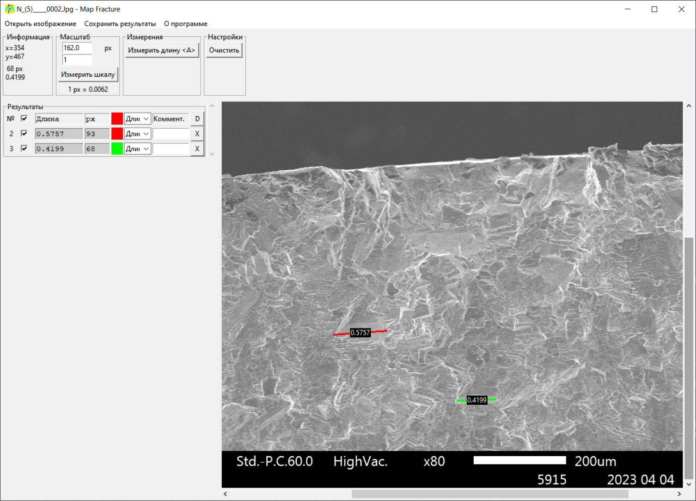

## Описание

Программа предназначена для измерения расстояния между точками на изображении.
Поддерживается масштаб и отображение отрезков в пикселях и в единицах масштаба.

## Инструкция по сборке pyinstaller

Переключиться на ветку release

	pyinstaller --onefile --noconsole --icon=data_file\mapfract.ico --add-binary data_file;data_file MapFract.py
